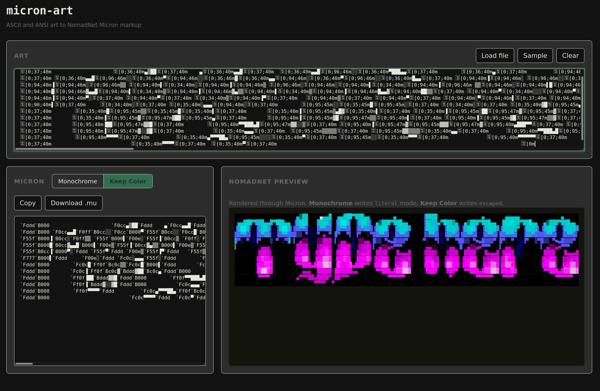
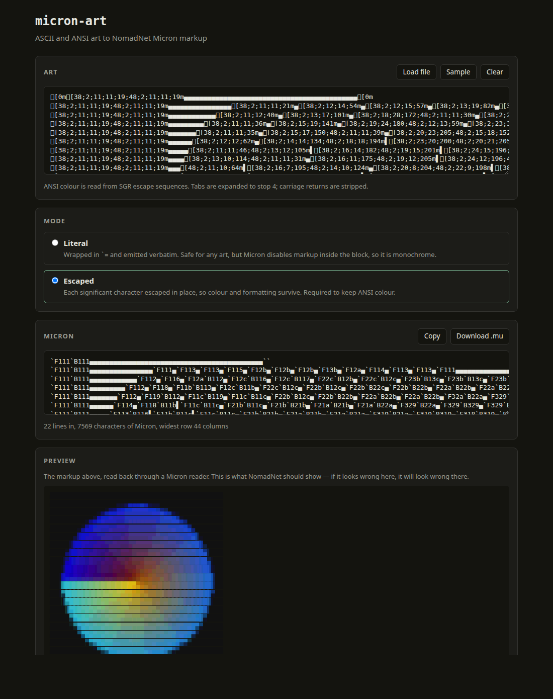

# micron-art

A tool to convert ASCII and ANSI art into [NomadNet](https://github.com/markqvist/NomadNet)
Micron markup.

**[Open the converter →](https://mecayotl.github.io/micron-art/)**

ASCII and ANSI art break sometimes when pasted into a .mu file. 
That's because Micron reads certain leading characters 
as formatting commands: - becomes a divider, # deletes the line, and > becomes a heading.
This tool escapes them so ASCII & ANSI art render in Micron as drawn.

A browser tool along with a Python CLI are provided. They share a suite of tests 
to make sure they stay in sync with each other. 

## Two output modes
**Literal** wraps the art in `` `= `` and displays it in a monochromatic format. 

**Escaped** maintains the color and formatting of the original text art.

Above: `chafa` output pasted in, converted in escaped mode. The preview
reads the generated markup back through a Micron reader, so it shows what
NomadNet will render.

## Quick start

In the browser, paste ANSI or ASCII text art into [the converter](https://mecayotl.github.io/micron-art/),
pick a mode, and copy the output.

From the command line:

    pip install -e src/cli

    micronart art.txt                          # literal mode, the default
    micronart -m escaped art.txt               # keeps color
    chafa image.png | micronart -m escaped

To put a page on a node, write it into the pages directory and restart
NomadNet:

    micronart -m literal art.txt > ~/.nomadnetwork/storage/pages/art.mu

## Local development

Clone the repo, then start a server.
Double clicking index.html won't work since browsers block ES module imports over file://. 

    git clone https://github.com/YOUR-USERNAME/micron-art.git
    cd micron-art
    python3 -m http.server 8000

Run the tests:

    node --test tests/*.test.js     # 114 tests
    python3 tests/test_converter.py # 56 tests

Both tests read from `tests/fixtures/`.

After changing the converter, rebuild the example pages and check that nothing
moved:

    ./examples/regenerate.sh
    git diff --exit-code examples/

## Layout

    index.html          the browser tool
    src/                browser modules: palette, escape, ansi, converter, preview, app
    src/cli/micronart/  the Python CLI, mirroring src/ module for module
    tests/fixtures/     inputs and expected output, the spec both implementations satisfy
    examples/           a NomadNet index and gallery, generated from examples/art/
    docs/               syntax notes, the ANSI mapping, and hosting

## Documentation

- **`docs/ansi-mapping.md`** — which SGR codes are handled, the color
  tables, and explains 24-bit conversion trade-offs
- **`tests/fixtures/README.md`** — explains the set of files that the UI & CLI are validated against

## Contributing

See [CONTRIBUTING.md](CONTRIBUTING.md)

## License

MIT. See [LICENSE](LICENSE).
